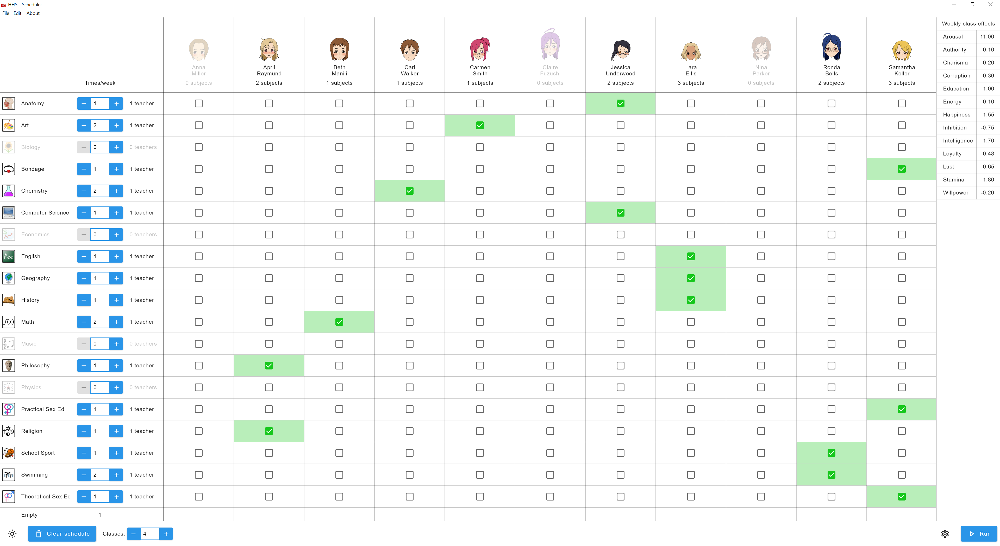

# HHS+ Scheduler

A standalone companion to the adult game [HHS+](https://www.henthighschool.com/hhsplus/) (NSFW)
which generates class schedules based on teacher assignments and the number of times each subject
should be taught per week. This makes it easy to specify the way you want your school to be run and
let this program figure out how to satisfy those requirements.

## Screenshots

| | |
| --- | --- |
|  |  |
|  |  |

## Installation

The latest release can be found in the
[Releases](https://github.com/tiquionophist/hhs-scheduler/releases) tab.

hhs-scheduler is distributed in three formats:
1. `.zip` standalone distributable for Windows. This is the **recommended** format. Simply download
the zip file, extract it, and run `hhs-scheduler.exe`, no installation necessary.
2. `.msi` installer for Windows. For users who want to install the application permanently and
access easily from the Start menu, etc. Bundled with a standard installer which will extract the
application to `C:\Program Files\` (or wherever you choose).
3. `.jar` executable JAR file for any platform. This is the smallest format since it does not need
to bundle a Java runtime. For advanced users who have a JRE installed (15+ is required). Run with
`java -jar hhs-scheduler.jar`. Note that I only test regularly against Windows.

## Usage

hhs-scheduler is designed to be intuitive it to use (if it's not - please leave feedback!). The main
idea is to make two selections:

1. which teachers are allowed to teach which subjects
2. how many times each subject should be taught each week

From this configuration (and the number of classes in the school) the application can generate a
full schedule which meets the requirements (and, of course, ensures that teachers only teach one
class per period, classrooms aren't overbooked, etc), which you can set in-game.

The basic configuration should be straightforward - check the subjects under each teacher that they
are allowed to teach, and set for each subject the number of times per week it is taught. Then click
"Run" at the bottom-right to generate a schedule. If the schedule is obviously impossible (for
example, a subject is supposed be taught but no teachers are assigned to it) an error message will
be shown instead. The generated schedule window has a tab for each class.

### Saving and loading configurations

So that you don't need to re-enter the entire configuration every time you make a change, you can
save and load schedule configuration files as `.json` files. Save a file with "File > Save
configuration" (ctrl+S) or load one with "File > Load configuration" (ctrl+O). These files can be
placed anywhere.

### Scheduler settings

For large schools with many teachers and subjects, generating a schedule is a difficult algorithmic
challenge. The scheduler algorithm can be adjusted by clicking the gear button next to the Run
button. The default randomized scheduler is the best in my experience, but using another one or
changing parameters might help find a solution.

## Miscellaneous

This application is licensed under the [MIT license](https://opensource.org/licenses/MIT).

This application is written in [Kotlin](https://kotlinlang.org/) and built with the
[Compose Multiplatform](https://github.com/JetBrains/compose-jb) UI framework. Standard Gradle
commands can be used to build it from the source, run tests, etc. For example:
- `./gradlew run` compiles and runs the application
- `./gradlew check` runs linting and unit tests
- `./gradlew createRelease` creates release artifacts (in `build/release-<version>/`)

---

The general solution to this kind of scheduling problem is known to be
[NP-complete](https://en.wikipedia.org/wiki/NP-completeness)!
([For example](https://math.stackexchange.com/q/2285015), as a reduction to k-coloring.)
This means that there is no known (and likely no possible) efficient algorithm to deal with large
instances of the problem (in this case, when you have many classes and many teachers). For simple
cases (scheduling 2 or 3 classes), an exhaustive search is possible but for even medium-size
problems (6-8 classes) the search space is too large to be brute forced. I've implemented a few
alternative scheduling algorithms; in my experience a randomized search which regularly starts from
scratch to avoid local maximums will solve any reasonable schedule in HHS+ in well under a second.
